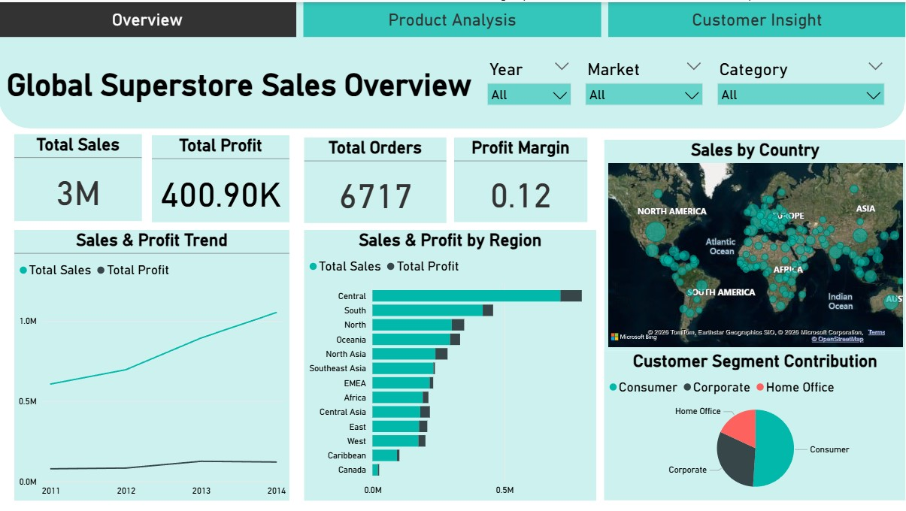
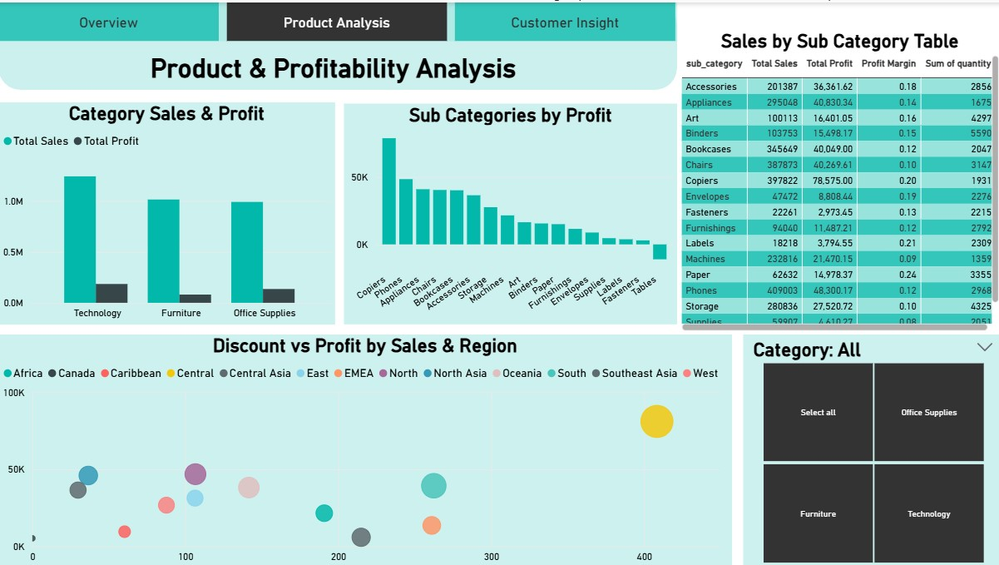
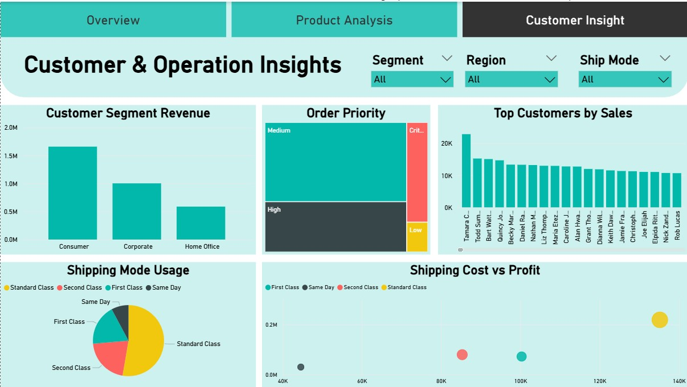

# Power BI Superstore Sales Analytics
## Project Overview
This project presents an interactive Power BI dashboard built using the Superstore Sales Analytics dataset. The dashboard analyzes retail sales performance, product profitability, customer behavior, and operational shipping patterns.
The objective of the project is to transform raw transactional sales data into actionable business insights through interactive visualizations and exploratory analysis.
The dashboard is designed to help answer key business questions related to sales performance, product profitability, discount impact, customer segments, and shipping operations.
## Dataset
Dataset Source: https://www.kaggle.com/datasets/thuandao/superstore-sales-analytics  
The dataset contains detailed transactional records including order information, customer details, product categories, sales and profit metrics, discounts, shipping details, geographic markets and regions.
## Bussiness Questions Explored
This dashboard addresses several important business questions:  
1. Which markets and regions generate the most sales and profit?  
2. Which product categories and sub-categories perform best?  
3. How do discounts impact profitability?  
4. Which shipping modes and priorities are most frequently used?  
5. Which customer segments contribute the most revenue?  
## Dashboard Structure
The dashboard is designed as a three-page analytical report to provide different levels of businees insights.  
### 1. Executive Sales Overview
This page provides a high-level summary of overall business performance. Key metrics and visuals include:  
1. KPI indicators for Total Sales, Total Profit, Profit Margin, and Total Orders.  
2. Sales trend analysis over time.  
3. Sales performance by country and region.  
4. Customer segment revenue contribution.  
Purpose is to provide executives with a quick overview of global business performance and growth patterns.
### 2. Product Performance & Profitability Analysis
This page focuses on product-level performance and profitability drivers. Key insights include:  
1. Sales and profit comparison across product categories.  
2. Identification of top performing sub-categories.  
3. Analysis of the relationship between discount levels and profitability.  
4. Detailed product performance table for exploration.  
Purpose is to identify high-performing products and understand the financial impact of discount strategies.
### 3. Customer & Operations Insights
This page analyzes customer behavior and operational shipping patterns. Key visuals include:  
1. Revenue contribution by customer segment.  
2. Distribution of shipping modes.  
3. Analysis of order priority levels.  
4. Relationship between shipping cost and profitability.  
5. Identification of top customers by sales.  
Purpose is to understand customer value and operational logistics performance.
## Data Preparation
Data preprocessing was performed using Power Query to ensure accurate analysis. Key steps included:  
1. Handling invalid date values in order date and ship date.  
2. Removing corrupted rows with inconsistent date formats.  
3. Converting text fields into appropriate data types.  
4. Creating calculated measures for key metrics such as Total Sales, Total Profit, Profit Margin, Total Orders  
These steps ensured the dataset was suitable for time-series analysis and business reporting.
## Tools & Technologies
This project was developed using Power BI, Power Query, DAX (Data Analysis Expressions), Data Visualization Techniques
## Dashboard Screenshots
### Executive Overview

### Product Performance Analysis

### Customer & Operatins Insights

## Key Insights
Some important insights derived from the dashboard include:  
1. Certain regions contribute disproportionately to global sales and profit.  
2. Technology category generates a strong revenue compared to other categories.  
3. The consumer segment contributes the largest share of orders.  
4. Standard shipping mode dominates order distribution, indicating customer preference for cost-effective delivery options.
## Author
Statistics Undergraduate. Interested in Data Analytics, Business Intelligence, and Machine Learning.
## Contact
LinkedIn: https://www.linkedin.com/in/dinithi-sooriyaarachchi-78692526b/  
GitHub: https://github.com/DinithiWasana
